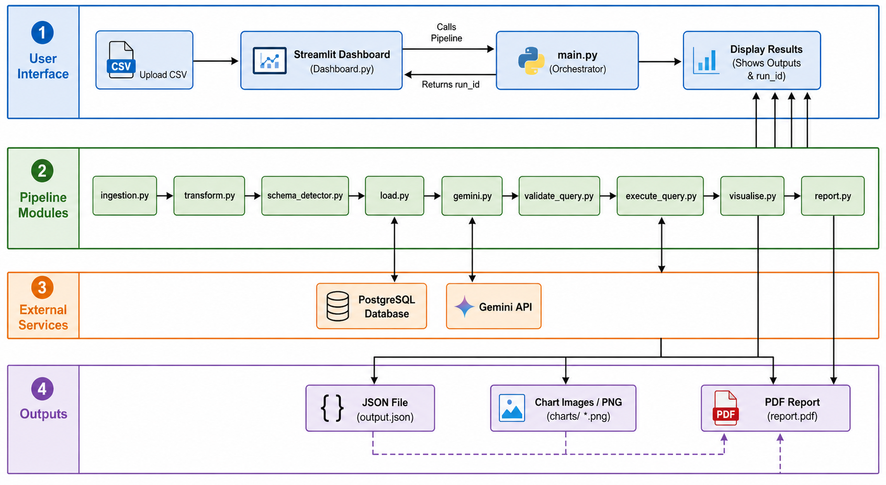

# AUTO-SCHEMA-PIPELINE

### Instead of spending hours figuring out what a CSV file is telling you, this pipeline will **automatically** detect the schema, and generate **AI-powered** analysis in seconds

## Problem Statement

When you get a new CSV file, you lose hours just trying to figure out what the data is telling you. Whether it’s sales logs,server logs or something else, a developer has to manually check headers, infer data types, and map out the schema before they can even start. This "cold start" is the most time-consuming part because you’re stuck writing boilerplate code and exploratory SQL just to see what’s inside.

Auto-Schema-Pipeline automates this entire manual process. Once you upload a CSV, the pipeline programmatically figures out the schema and uses Gemini to generate specific SQL queries based on the data it sees. Instead of you writing queries by hand, the results appear immediately on a dashboard and a PDF. It replaces the "understanding" phase with an automated loop, so you go from a raw file to clear results in seconds.

## Demo

**[Live Demo](https://auto-schema-pipeline.streamlit.app/)**

Upload any CSV and the pipeline handles the rest — schema detection, 
database load, AI query generation, visualisations, and a downloadable 
PDF report.

> Screenshots and demo video coming soon.

## What This Project Does

- Detects the schema of any uploaded CSV — column names, data types, 
  and structure — with no manual configuration
- Dynamically creates a PostgreSQL table and loads the data, 
  named and tracked per file
- Sends schema and sample rows to Google Gemini, which generates 
  targeted SQL queries specific to that dataset
- Validates each generated query before execution — bad queries 
  are discarded, not crashed on
- Executes valid queries against PostgreSQL and stores results 
  as a structured JSON, unique to each pipeline run
- Automatically selects the appropriate chart type per result 
  and renders visualisations
- Surfaces everything on a Streamlit dashboard with per-run 
  navigation and downloadable PDF report

## System Architecture


The user uploads any CSV through the dashboard, triggering the pipeline. 
The dataset is cleaned, schema is inferred, and a PostgreSQL table is 
dynamically created and populated. Gemini then receives the schema and 
sample rows, generates targeted SQL queries, which are validated, executed 
against the database, and stored as a structured JSON unique to that run.
Results are surfaced on the Streamlit dashboard and a downloadable PDF. 
If any critical stage fails, the run is marked as failed and an appropriate 
error is shown on the dashboard.

## Pipeline flow

1. **Data Ingestion** — The user-uploaded CSV is fetched from storage 
   and loaded into a Pandas DataFrame for processing.

2. **Cleaning & Preprocessing** — Duplicates are removed and missing 
   values are filled to ensure the dataset is accurate before it touches 
   the database.

3. **Schema Detection** — Each DataFrame column is analysed, and its 
   type is mapped to the equivalent PostgreSQL data type.

4. **Database Load** — A PostgreSQL table is dynamically created from 
   the detected schema and populated with the cleaned data. The run is 
   logged to the pipeline_runs table.

5. **AI Query Generation** — The schema and sample rows are sent to 
   Google Gemini, which identifies the dataset type and generates 
   targeted SQL queries for meaningful analysis.

6. **Query Validation** — Each AI-generated query is vetted. Harmful 
   commands are blocked and structurally invalid queries are discarded 
   before execution.

7. **Query Execution** — Valid queries are executed against PostgreSQL. 
   Results are captured and stored as a structured JSON, unique to 
   that pipeline run.

8. **Report Generation** — The JSON is parsed and formatted into a 
   structured, downloadable PDF report.

9. **Dashboard Rendering** — Results are surfaced on an interactive 
   Streamlit dashboard. If the run succeeded, the user can explore 
   insights and download the PDF. If a critical stage failed, an 
   appropriate error is displayed.

## Tech Stack

| Category       | Technology              |
|----------------|-------------------------|
| Language       | Python                  |
| Data           | Pandas                  |
| Database       | PostgreSQL, SQLAlchemy  |
| AI Layer       | Google Gemini           |
| Visualisation  | Matplotlib              |
| Dashboard      | Streamlit               |
| Reporting      | FPDF2                   |
| Config         | python-dotenv           |
| Containerisation  | Docker               |

## Project Structure

```
auto-schema-pipeline/
├── config/                  
├── data/
│   └── raw/                 
├── logs/                    
├── outputs/
│   ├── graphs/              
│   ├── json/                
│   └── reports/             
├── src/
│   ├── ingestion.py         
│   ├── schema_detector.py   
│   ├── transform.py         
│   ├── load.py              
│   ├── gemini.py            
│   ├── validate_query.py    
│   ├── execute_query.py     
│   └── visualise.py         
├── tests/
│   ├── test_schema_detector.py
│   └── test_transform.py    
├── .env.example             
├── .gitignore               
├── conftest.py              
├── dashboard.py
├── Dockerfile 
├── docker-compose.yml 
├── .dockerignore              
├── main.py                  
└── README.md                
```

## Local Setup

### Option 1 — Docker (Recommended)

**Prerequisites:** Docker Desktop installed and running.

1. Clone the repository
```bash
git clone https://github.com/parth-hue/auto-schema-pipeline.git
cd auto-schema-pipeline
```

2. Configure environment variables  
   Copy `.env.example` to `.env` and fill in your values:
   `DATABASE_URL=your_supabase_connection_string`
   `GEMINI_API_KEY=your_key_here`

Get your Gemini API key from [aistudio.google.com](https://aistudio.google.com)  
Get your Supabase connection string from [supabase.com](https://supabase.com)

3. Run
```bash
docker compose up --build
```
Open `http://localhost:8501` in your browser.

---

### Option 2 — Manual Setup

**Prerequisites:** Python 3.10+, PostgreSQL or Supabase account.

1. Clone the repository
```bash
git clone https://github.com/parth-hue/auto-schema-pipeline.git
cd auto-schema-pipeline
```

2. Create and activate a virtual environment
```bash
python -m venv venv

# Windows
.\venv\Scripts\Activate.ps1

# Mac / Linux
source venv/bin/activate
```

3. Install dependencies
```bash
pip install -r requirements.txt
```

4. Configure environment variables  
   Copy `.env.example` to `.env` and fill in your values.

5. Run
```bash
streamlit run dashboard.py
```

## Engineering Challenges and Solutions

1. **Dual-Library Connection Conflict**   
Initially both psycopg2 and SQLAlchemy were running side by side, creating 
connection conflicts and unclear ownership. The root cause was not 
understanding the distinction — psycopg2 provides low-level manual control 
while SQLAlchemy handles connection pooling at a higher abstraction. Resolved 
by consolidating entirely on SQLAlchemy and removing psycopg2 from the stack.

2. **Hardcoded Credentials Pushed to GitHub**  
The most serious mistake of the project. Database credentials were committed 
directly into the public repo after forgetting to add `.env` to `.gitignore`. 
Deleting the file alone was insufficient — credentials persist in git history. 
The fix required full credential rotation and scrubbing the entire git history 
with BFG Repo Cleaner.

3. **Gemini Returning Unstructured Output**  
Gemini doesn't consistently return clean JSON. Parsing failures occurred 
because responses contained markdown fences, preamble text, or inconsistent 
structure. The fix was prompt engineering for strict JSON-only output — but 
resolving it required understanding why parsing was breaking, not just 
patching the symptom.

4. **Validating AI-Generated SQL Safely**  
Gemini's queries could not be trusted blindly. A validation layer was built 
before execution using a fail-fast `elif` chain. The design challenge was 
deciding which failures should discard a single query versus which should halt 
the pipeline entirely — without silently corrupting downstream results.

5. **Automatic Chart Type Selection**  
`visualise.py` initially defaulted to line charts regardless of data 
structure. When query results contained categorical string keys, line charts 
were meaningless. Resolved by building a `map_graph_types` function that 
inspects the result structure and maps it to the correct chart type — bar, 
pie, or line.

6. **Output Size and Report Bloat**  
Query results with thousands of rows produced oversized JSON files and 100+ 
page PDF reports. Both problems shared the same root cause — no truncation on 
query output. Capping results at 10 rows at the execution stage fixed both 
simultaneously. Table and image alignment in the PDF required additional 
iteration to get right.

7. **Pipeline Architecture — Critical vs. Non-Critical Failures**  
Deciding which failures should halt the pipeline versus log-and-continue was 
an architectural decision, not a syntax one. `main.py` was also refactored 
from a top-level script into a callable `run_pipeline()` function for 
dashboard integration — a structural change that required rethinking error 
handling and return values entirely.

8. **Session State Management in Streamlit**  
The two-state dashboard architecture required careful thinking about when to 
reset state. Detecting a new file upload reliably across rerenders was the 
specific challenge — naive approaches broke on rerender. The solution was 
filename comparison via `st.session_state`, which correctly distinguishes a 
new upload from a simple rerender.

## Future Enhancements

1. **Multi-format ingestion** — Currently the pipeline only accepts CSV files. 
   Extending ingestion to support `.xlsx`, `.json`, and other formats would 
   make the pipeline usable across a wider range of real-world data sources.

2. **API and cloud storage ingestion with scheduling** — Currently the pipeline 
   runs only when a user manually uploads a file. Automating ingestion from 
   REST APIs or cloud storage (S3, Google Cloud Storage) and scheduling runs 
   would make this a fully autonomous pipeline.

3. **CI/CD test gating** — Currently the pipeline runs regardless of test 
   outcomes. Adding automated test gating would block execution if any test 
   fails, preventing bad data or broken logic from reaching production.

4. **Incremental loading** — Currently the pipeline reloads the entire dataset 
   on every run. Incremental loading would process only rows added since the 
   last run, reducing redundant computation and database writes at scale.

5. **Alerting** — Currently there is no notification system for pipeline 
   failures. Email or Slack alerts would ensure the developer is informed 
   immediately when an automated run fails.

## Author

**Parth Shah**  
[LinkedIn](https://www.linkedin.com/in/parth-shah-26154a372/) · [GitHub](https://github.com/parthrshah202-hash)

## License

MIT License — see [LICENSE](LICENSE) for details.